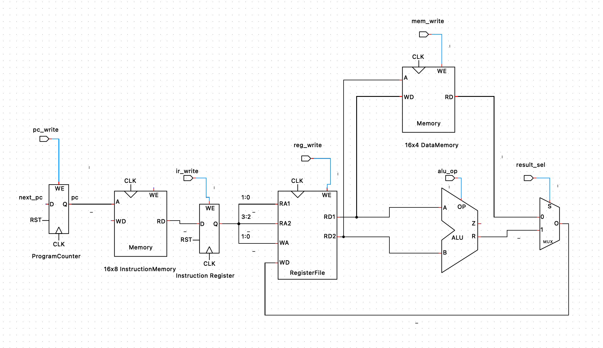
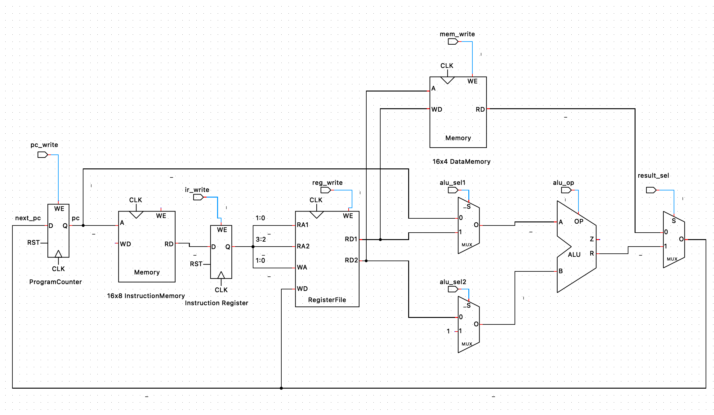

# 4-bit CPU design in System Verilog
## Objective
The task is to design and implement a 4-bit CPU in System Verilog. For detailed instructions, please
see the [project requirements](project.pdf). 

## Proposed Design
The proposed design is based on datapath and control unit for a FSM based multi-cyle CPU.

Datapath refers to all the components of the CPU which handle data flow i.e. perform some operations
and maintain state. For this project, the datapath consists of:
1. 8-bit program counter
2. 16x8 instruction memory i.e. 16 addressable memory locations, each 8-bit wide to hold 16 8-bit CPU instructions.
3. 16x4 data memory i.e. 16 addressable memory locations to hold 4-bit data.
4. Register file consisting of four 4-bit registers.
5. ALU that performs arithematic and logical operations.

<figure style="text-align: center;">
  
  <figcaption>Datapath elements</figcaption>
</figure>

It is important to note that each of theses datapath element has control signals and depending on the situation,
only some of them may be activated by signals, asserted via the control unit.

As mentioned above, the control unit is responsible for generating the control signals to enable components in the
datapath or control the flow of data within the data path. It is implemented as a mealy FSM (Finite State Machine) i.e.
it is a state machine that transitions through the following 5 states/steps, whereas next state depends on the current state
as well as the current input, which is the current instruction in this case.

> [!NOTE] 
> The state transition happens on the positive edge of the clock.
> 
> By default instruction and program memories are empty/full of garbage values. Therefore,
> special consideration were made to program the instruction memory first with the program code
> via testbench and additional instructions were introduced to initialize/write
> some data to the data memory first.

1. ***FETCH***: CPU reads an instruction from the instruction memory, containing CPU instructions/program code.
2. ***DECODE***: CPU decodes the instruction read in the fetch step and asserts corresponding control signals via the control unit, to enable the required parts of the datapath.
3. ***EXECUTE***: If it is an arithematic instructions e.g `ADD`, `SUB`, then the control unit asserts signals for the ALU. If it is memory access instruction .e.g `LD`, `ST`, CPU uses ALU to prepare the memory address to be read/written.
4. ***WRITE_BACK***: CPU asserts signal to write results into register file.
5. ***MEMORY_ACCESS***: CPU asserts signals to read/write from/to data memory.

> [!IMPORTANT]
> It is important to note that some of these datapath elements like memory, register file, ALU have instrinsic delays e.g.:
> 1. read time which is the time it takes to read data from memory.
> 2. processing time i.e. time it take for the ALU operation to complete.
> 3. setup time i.e. the time it takes for the signals to achieve stable value.
> 
> Therefore during each state, only one of the memory, ALU, or register file datapath element must be used.

## Instruction Format
An instruction is 8-bit wide with first 4-bits reserved for the opcode and the rest of the 4-bits
are for the operand. 

> [!NOTE]
> As will be explained further in the document, certain liberties were taken regarding the layout
> of the 4-bit operand into source and destination register addresses and immediate value. 

## Required ISA
<table>
  <tr>
    <th>Mnemonic </th>
    <th>Description</th>
    <th>Opcode</th>
  </tr>
  <tr>
    <td>ADD</td>
    <td>Add two registers</td>
    <td>0000</td>
  </tr>
  <tr>
    <td>SUB</td>
    <td>Subtract two registers</td>
    <td>0001</td>
  </tr>
  <tr>
    <td>AND</td>
    <td>Bitwise AND</td>
    <td>0010</td>
  </tr>
  <tr>
    <td>OR</td>
    <td>Bitwise OR</td>
    <td>0011</td>
  </tr>
  <tr>
    <td>XOR</td>
    <td>Bitwise XOR</td>
    <td>0100</td>
  </tr>
  <tr>
    <td>LD</td>
    <td>Load from memory into register</td>
    <td>0101</td>
  </tr>
  <tr>
    <td>ST</td>
    <td>Store from memory into register</td>
    <td>0110</td>
  </tr>
  <tr>
    <td>JMP</td>
    <td>Jump to address</td>
    <td>0111</td>
  </tr><tr>
    <td>BEQ</td>
    <td>Branch if equal</td>
    <td>1000</td>
  </tr><tr>
    <td>BNE</td>
    <td>Branch if not equal</td>
    <td>1001</td>
  </tr>
</table>

## Additional instructions
As mentioned earlier, by default the data memory is empty/full of garbage values and for a meaningful program/test, it requires intialisation. One possible workaround was to hard-code the data values in the data memory (in system verilog module) but that goes against the real world usage and is not a flexible design choice. 

Ideally, it should be possible to initialise data memory first before running a program (as real world programs do e.g. how the C standard library initialises `.bss` and `.data` segments during program initialisation).

Unfortunately, none of the existing instructions from the required ISA enable initializing the data memory on the startup.

In a real RISC-V ISA, there are function bits inside an instruction that can customise the behavior of instruction by selecting a different layout of the operand bits.

In this case due to limited instruction bits, additional opcodes are introduced to define the following additional instructions.

<table>
  <tr>
    <th>Mnemonic </th>
    <th>Description</th>
    <th>Opcode</th>
  </tr>
  <tr>
    <td>MOV</td>
    <td>Copy value from one register to other</td>
    <td>1010</td>
  </tr>
  <tr>
    <td>MOVI</td>
    <td>Store an immediate value to a register</td>
    <td>1011</td>
  </tr>
  <tr>
    <td>ADDI</td>
    <td>Add immediate value to a register</td>
    <td>1100</td>
  </tr>
  <tr>
    <td>SUBI</td>
    <td>Subtract immediate value from a register</td>
    <td>1101</td>
  </tr>
  <tr>
    <td>LSLI</td>
    <td>Logical shift the register value left by places encoded as immediate value </td>
    <td>1110</td>
  </tr>
</table>

## Iterative Design Process
Let's start implementing instructions one by one, and see how it evolves the design as we go.

### Arithematic Instructions (ADD, SUB, AND, OR, XOR)

#### ADD
```
+---------------------+----------+----------+
| 4-bit opcode (0000) | 2-bit rs | 2-bit rd |
+---------------------+----------+----------+
```
ADD instruction adds two registers and stores the result into destination register.
For example:
```
 ADD RD, RS --> RD = RD + RS
```

#### SUB
```
+---------------------+----------+----------+
| 4-bit opcode (0001) | 2-bit rs | 2-bit rd |
+---------------------+----------+----------+
```
SUB instruction subtracts two registers and stores the result into destination register.
For example:
```
 SUB RD, RS --> RD = RD - RS
```

#### AND
```
+---------------------+----------+----------+
| 4-bit opcode (0010) | 2-bit rs | 2-bit rd |
+---------------------+----------+----------+
```
AND instruction computes bitwise-AND of two registers and stores the result into
destination register.
For example:
```
 AND RD, RS --> RD = RD & RS
```

#### OR
```
+---------------------+----------+----------+
| 4-bit opcode (0011) | 2-bit rs | 2-bit rd |
+---------------------+----------+----------+
```
OR instruction computes bitwise-OR of two registers and stores the result into
destination register.
For example:
```
 SUB RD, RS --> RD = RD | RS
```

#### XOR
```
+---------------------+----------+----------+
| 4-bit opcode (0100) | 2-bit rs | 2-bit rd |
+---------------------+----------+----------+
```
XOR instruction computes bitwise-XOR of two registers and stores the result into
destination register.
For example:
```
 XOR RD, RS --> RD = RD ^ RS
```

For now, let's forget about calculating the `next_pc` value and assumes it is always updated/incremented after an instruction is fetched. We will look into implementing a PC update mechanism later.

<figure style="text-align: center;">
  
  <figcaption>Arithmetic instructions</figcaption>
</figure>

> [!NOTE]
> The lines in blue represent control signals from the control unit.
 
During *FETCH* state, control unit asserts the `pc_write` signal to enable updating the `program counter (PC)` register with the `next_pc` value. Note that since the register write happens on the positive clock edge, the actual value of the `pc` gets updated on the next state transition from *FETCH* to *DECODE* i.e. as soon as the *DECODE* state becomes the current state, `pc` register stores the updated value `next_pc`. Since `pc` is used as address input for fetching the current instruction from the instruction memory, updated `pc` would mean subsequent states will see an updated instruction, which is not the correct behavior. Therefore, the current instruction is also stored in the instruction register `ir` before `pc` is updated by asserting `ir_write` signal during *FETCH* state.

During *DECODE* state, both the source and destination registers are read from the register file and the values are allowed to stablize. No control signals are asserted.

During *EXECUTE* state, ALU executes the operation specified via `alu_op` input to the ALU. The value of `alu_op` depends on the current instruction. Following is the table for different values of `alu_op` for each instruction. By the end of *EXECUTE* state, the ALU result is ready to be written back to the register.

During *WRITE_BACK* state, `reg_write` signal is asserted to enable writing the register file. The least significant 2-bits (for destination register or `RD`) are used as write address.

<table>
  <tr>
    <th>Instruction</th>
    <th>ALU OP</th>
  </tr>
  <tr>
    <th>ADD</th>
    <th>000</th>
  </tr>
  <tr>
    <th>SUB</th>
    <th>001</th>
  </tr>
  <tr>
    <th>AND</th>
    <th>010</th>
  </tr>
  <tr>
    <th>OR</th>
    <th>011</th>
  </tr>
  <tr>
    <th>XOR</th>
    <th>100</th>
  </tr>
  <tr>
    <th>LT</th>
    <th>101</th>
  </tr>
  <tr>
    <th>LSL</th>
    <th>110</th>
  </tr>
</table>

### LD
```
+---------------------+----------+----------+
| 4-bit opcode (0101) | 2-bit rs | 2-bit rd |
+---------------------+----------+----------+
```
LD instruction copies the data stored at memory address contained in rs register
and stores the result into destination register.
For example:
```
 LD RD, RS --> RD = mem[RS value]
```

Here's the updated design with `LD` instruction.

<figure style="text-align: center;">
  
  <figcaption>LD instruction</figcaption>
</figure>

The difference is a 2to1 mux added to the output of ALU and data memory so that in the *WRITE_BACK* state, CPU can select between ALU result and data memory out using `result_sel` signal, while writing the register file. The rest remains the same.


### ST
```
+---------------------+-----------+-----------+
| 4-bit opcode (0110) | 2-bit rs1 | 2-bit rs2 |
+---------------------+-----------+-----------+
```
ST instruction stores the data contained in rs2 register to the memory address
contained inside rs1 register.

For example:
```
 ST RS1, RS2 --> mem[RS1] = RS2
```

Here's the updated design with `ST` instruction.

<figure style="text-align: center;">
  
  <figcaption>ST Instruction</figcaption>
</figure>

During the *MEMORY_ACCESS* state, `mem_write` signal is asserted to enable writing to the data memory.

### Updating PC
Now before implementing the rest of the instruction i.e. `JMP`, `BEQ`, `BNE` modifying the `program counter (pc)`, lets look into implementing a mechanism to updating the `pc` during normal execution.

As we discussed before, the *FETCH* state asserts signals to update the `pc` register with `next_pc` value but the actual update (`pc = next_pc`) happens during the transition to *DECODE* state (positive clock edge). So far we have ignored the calculation of `next_pc` but now it's time to address this.

Updating the `pc` means pointing to the next instruction address in the data memory and as each instruction occupies one memory location, the value of `next_pc` should be `next_pc = pc + 1`

Since it is an addition operation, we need to utilise ALU. The idea is to use ALU in the *FETCH* state to calculate the value of `next_pc = PC + 1`. We need a mux before the ALU to switch between `registers` and `pc` as operands. 

<figure style="text-align: center;">
  
  <figcaption>Update Program Counter</figcaption>
</figure>

### JMP
```
+---------------------+-----------------------+
| 4-bit opcode (0111) | 4-bit immediate val   |
+---------------------+-----------------------+
```
JMP instruction changes the program counter to the absolute address specified by
the 4-bit immediate value.
For example:
```
 JMP 4'b1010 --> new PC = 4'b1010
```

This means CPU has to discard the incremented `pc` value calculated in the *FETCH* state and use the 4-bit immediate value directly as the value of the `pc`. This is achieved by replacing 2to1 result mux with 4to1 mux and selecting the 4-bit immediate value to update the `pc`. 

<figure style="text-align: center;">
  
  <figcaption>JMP Instruction</figcaption>
</figure>

### Branch Instructions

The branching instructions `BEQ` and `BNE` are similar to to `JMP` with the exception that the branching is conditional.

On RISC-V, both `BEQ` and `BNE` instructions compare the contents of two register and based on the result, jump to an address. However, in this case it is impossible to encode both registers
and the jump address into a single instruction. Therefore, the convention is that both `BEQ` and `BNE` will consider the zero flag, asserted by any of the previous instructions, to determine whether to branch or not.

To determine if two registers are equal or not, the program can use `SUB` instruction to subtract them from each other. If they are equal, the zero flag will be asserted, which can then be consumed by the subsequent branching instruction.

To store the zero flag, another register is introduced.

#### BEQ
```
+---------------------+-----------------------+
| 4-bit opcode (1000) | 4-bit immediate val   |
+---------------------+-----------------------+
```
BEQ instruction changes the program counter to the absolute address specified by
the 4-bit immediate value, only if the zero flag is set.

For example:
```
R0 = 2;
R1 = 2;
SUB R0, R1 // sets zero flag
BEQ 4'b1010 --> new PC = 4'b1010
```

#### BNE
```
+---------------------+-----------------------+
| 4-bit opcode (1001) | 4-bit immediate val   |
+---------------------+-----------------------+
```
BNE instruction changes the program counter to the absolute address specified by
the 4-bit immediate value, only if the zero flag is not set.

For example:
```
R0 = 4;
R1 = 2;
SUB R0, R1 // zero flag not set
BNE 4'b1010 --> new PC = c4'b1010
```

Here's the updated design.

<figure style="text-align: center;">
  
  <figcaption>Branch Instruction</figcaption>
</figure>

### MOV
```
+---------------------+----------+----------+
| 4-bit opcode (1010) | 2-bit rs | 2-bit rd |
+---------------------+----------+----------+
```
MOV instruction stores the data from rs register to the rd register. For example:
```
MOV RD, RS results RD = RS
```

Here's the update design considering `MOV` instruction. It is based on the premise that
`RD = 0 + RS` i.e. it selects `0` and `RS` as ALU operands and addition operation.

<figure style="text-align: center;">
  
  <figcaption>MOV Instruction</figcaption>
</figure>


### MOVI
```
+---------------------+-----------+----------+
| 4-bit opcode (1011) | 2-bit imm | 2-bit rd |
+---------------------+-----------+----------+
```
MOVI instruction stores the 2-bit immediate value bit-extended to 4 bits into the rd register.
For example:
```
MOVI RD, #1 results RD = 4'b0001
```

Here's the update design considering `MOVI` instruction. It is based on the premise that
`RD = 0 + imm` i.e. it selects `0` and `imm` as ALU operands and addition operation.

It also introduces a new `extend` element that converts 2-bit immediate value to 4-bit value.

> [!WARNING]
> Beware, the `extend` unit doesn't sign-extend the 2-bit value. So it converts 2-bit value `10` to 4-bit `0010` instead of `1110` as sign extender would do. 

<figure style="text-align: center;">
  
  <figcaption>MOVI Instruction</figcaption>
</figure>

### ADDI
```
+---------------------+-----------+----------+
| 4-bit opcode (1100) | 2-bit imm | 2-bit rd |
+---------------------+-----------+----------+
```
ADDI instruction adds the 2-bit immediate value bit-extended to 4 bits to the rd register.
For example:
```
RD = 4'd3;
ADDI RD, #1 results RD = 4'd4
```

No further changes required.

### SUBI
```
+---------------------+-----------+----------+
| 4-bit opcode (1101) | 2-bit imm | 2-bit rd |
+---------------------+-----------+----------+
```
SUBI instruction subtracts the 2-bit immediate value bit-extended to 4 bits from the rd register. For example:
```
RD = 4'd3;
SUBI RD, #1 results RD = 4'd2
```

No further changes required.

### LSLI
```
+---------------------+-----------+----------+
| 4-bit opcode (1110) | 2-bit imm | 2-bit rd |
+---------------------+-----------+----------+
```
LSLI instruction left shifts the rd register value by 2-bit immediate bit positions. For example:
```
RD = 4'b0011;
LSLI RD, #2 results RD = 4'b1100
```

No further changes required.

## State Transitions
### ADD/SUB/AND/OR/XOR/MOV/MOVI/ADDI/SUBI/LSLI


### LD


### ST


### JMP/BEQ/BNE


## Control Signals
<table>
  <tr>
    <th>Instruction</th>
    <th>FETCH</th>
    <th>DECODE</th>
    <th>EXECUTE</th>
    <th>MEMORY_ACCESS</th>
    <th>WRITE_BACK</th>
  </tr>
  <tr>
    <th>ADD</th>
    <th>pc_write=1<br>ir_write=1<br>alu_sel1=00<br>alu_sel2=01<br>alu_op=000<br>result_sel=01</th>
    <th>NA</th>
    <th>alu_sel1=01<br>alu_sel2=00<br>alu_op=000<br></th>
    <th>NA</th>
    <th>reg_write=1<br>result_sel=01</th>
  </tr>
  <tr>
    <th>SUB</th>
    <th>pc_write=1<br>ir_write=1<br>alu_sel1=00<br>alu_sel2=01<br>alu_op=000<br>result_sel=01</th>
    <th>NA</th>
    <th>alu_sel1=01<br>alu_sel2=00<br>alu_op=001<br>zero_write=1</th>
    <th>NA</th>
    <th>reg_write=1<br>result_sel=01</th>
  </tr>
  <tr>
    <th>AND</th>
    <th>pc_write=1<br>ir_write=1<br>alu_sel1=00<br>alu_sel2=01<br>alu_op=000<br>result_sel=01</th>
    <th>NA</th>
    <th>alu_sel1=01<br>alu_sel2=00<br>alu_op=010<br></th>
    <th>NA</th>
    <th>reg_write=1<br>result_sel=01</th>
  </tr>
  <tr>
    <th>OR</th>
    <th>pc_write=1<br>ir_write=1<br>alu_sel1=00<br>alu_sel2=01<br>alu_op=000<br>result_sel=01</th>
    <th>NA</th>
    <th>alu_sel1=01<br>alu_sel2=00<br>alu_op=011<br></th>
    <th>NA</th>
    <th>reg_write=1<br>result_sel=01</th>
  </tr>
  <tr>
    <th>XOR</th>
    <th>pc_write=1<br>ir_write=1<br>alu_sel1=00<br>alu_sel2=01<br>alu_op=000<br>result_sel=01</th>
    <th>NA</th>
    <th>alu_sel1=01<br>alu_sel2=00<br>alu_op=100<br></th>
    <th>NA</th>
    <th>reg_write=1<br>result_sel=01</th>
  </tr>
  <tr>
    <th>LD</th>
    <th>pc_write=1<br>ir_write=1<br>alu_sel1=00<br>alu_sel2=01<br>alu_op=000<br>result_sel=01</th>
    <th>NA</th>
    <th>NA<br></th>
    <th>NA</th>
    <th>reg_write=1<br>result_sel=01</th>
  </tr>
  <tr>
    <th>ST</th>
    <th>pc_write=1<br>ir_write=1<br>alu_sel1=00<br>alu_sel2=01<br>alu_op=000<br>result_sel=01</th>
    <th>NA</th>
    <th>NA<br></th>
    <th>mem_write=1</th>
    <th>NA</th>
  </tr>
  <tr>
    <th>JMP</th>
    <th>pc_write=1<br>ir_write=1<br>alu_sel1=00<br>alu_sel2=01<br>alu_op=000<br>result_sel=01</th>
    <th>pc_write=1<br>result_sel=10</th>
    <th>NA<br></th>
    <th>NA</th>
    <th>NA</th>
  </tr>
  <tr>
    <th>BEQ</th>
    <th>pc_write=1<br>ir_write=1<br>alu_sel1=00<br>alu_sel2=01<br>alu_op=000<br>result_sel=01</th>
    <th>pc_write=zero<br>result_sel=10</th>
    <th>NA<br></th>
    <th>NA</th>
    <th>NA</th>
  </tr>
  <tr>
    <th>BNE</th>
    <th>pc_write=1<br>ir_write=1<br>alu_sel1=00<br>alu_sel2=01<br>alu_op=000<br>result_sel=01</th>
    <th>pc_write=!zero<br>result_sel=10</th>
    <th>NA<br></th>
    <th>NA</th>
    <th>NA</th>
  </tr>
  <tr>
    <th>MOV</th>
    <th>pc_write=1<br>ir_write=1<br>alu_sel1=00<br>alu_sel2=01<br>alu_op=000<br>result_sel=01</th>
    <th>NA</th>
    <th>alu_sel1=10<br>alu_sel2=00<br>alu_op=000</th>
    <th>NA</th>
    <th>reg_write=1<br>result_sel=01</th>
  </tr>
  <tr>
    <th>MOVI</th>
    <th>pc_write=1<br>ir_write=1<br>alu_sel1=00<br>alu_sel2=01<br>alu_op=000<br>result_sel=01</th>
    <th>NA</th>
    <th>alu_sel1=10<br>alu_sel2=10<br>alu_op=000</th>
    <th>NA</th>
    <th>reg_write=1<br>result_sel=01</th>
  </tr>
  <tr>
    <th>ADDI</th>
    <th>pc_write=1<br>ir_write=1<br>alu_sel1=00<br>alu_sel2=01<br>alu_op=000<br>result_sel=01</th>
    <th>NA</th>
    <th>alu_sel1=01<br>alu_sel2=10<br>alu_op=000</th>
    <th>NA</th>
    <th>reg_write=1<br>result_sel=01</th>
  </tr>
  <tr>
    <th>SUBI</th>
    <th>pc_write=1<br>ir_write=1<br>alu_sel1=00<br>alu_sel2=01<br>alu_op=000<br>result_sel=01</th>
    <th>NA</th>
    <th>alu_sel1=01<br>alu_sel2=10<br>alu_op=001</th>
    <th>NA</th>
    <th>reg_write=1<br>result_sel=01</th>
  </tr>
  <tr>
    <th>LSLI</th>
    <th>pc_write=1<br>ir_write=1<br>alu_sel1=00<br>alu_sel2=01<br>alu_op=000<br>result_sel=01</th>
    <th>NA</th>
    <th>alu_sel1=01<br>alu_sel2=10<br>alu_op=110</th>
    <th>NA</th>
    <th>reg_write=1<br>result_sel=01</th>
  </tr>
</table>